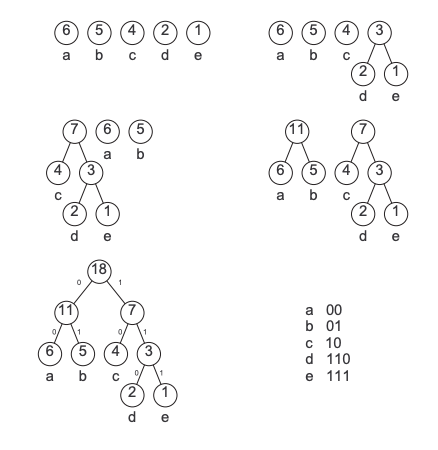

<!--
headingDivider: 2
-->

# 注意機構 (attention mechanism)

- 入力情報の中で特に注目すべき箇所を指定するための機能
	- 画像処理、文字列処理 etc で使用されている
- メリット：
	- 入力の系列情報の冒頭部分を伝播でき、モデルの性能がよくなる
	- (特に画像処理で？) 特定の箇所に着目するので計算コストを抑えれる

## 種類 

- ソフト注意機構 (soft attention)
	- 入力情報の重み付き平均を用いる方法
- ハード注意機構 (hard attention)
	- 入力情報のどれか一つを確率的に選択して用いる方法
	- 2018年の段階では "hard attention (...略...) is much less widely used" [url](https://arxiv.org/pdf/1808.00300.pdf)
		- この論文では、hard attention ベースの技術で competitive performance を出した
- 自己注意機構（self attention）
	- Transformer 等で使用されている機構
	- どっちに似てる？まったく別？

## ソフト注意機構 

- 系列変換モデルを考える
- 入力系列 $\{x_1,...,x_I\}$、符号化されたベクトル $\{h_1^{(s)},..h_I^{(s)}\}$ として、各時刻の符号化層の隠れ状態ベクトルは

$$
h_i^{(s)} = \Psi^{(s)}\left( x_i, h_{i-1}^{(s)}\right)
$$

- また、復号化器が予測する隠れ状態ベクトルは：

$$
h_j^{(t)} = \Psi^{(t)} (y_j, h_{j-1}^{(t)})
$$

- 通常の系列変換モデルでは encoder → decoder へは $h_I^{(s)}$ のみが渡される
	- $h_I^{(s)}$には全ての情報が含まれているが...もう少し直接的に復号化器に伝播する方法はないか？
	- 入力初期の情報（ex. 文頭の情報）は $\Psi^{(s)}$ が $I$ 回適用されて尚有用な情報として残っておく必要がある

- これらを解決するために、ソフト注意機構を使用することができる

##

- 符号化器の隠れ状態ベクトル $h_i^{(s)}$ の重要度を $a_{ij}$ と定義する
- $a_{ij}$ による重み付き平均は ([Issue #15](https://github.com/mlpnlp/mlpnlp/issues/15))： 
	- 復号化器の隠れ状態 $h_j^{(t)}$ に対して考えるので、$j$ を添える

$$
\bar{h}_j = \sum_{i=1}^I a_{ij}h_{i}^{(s)} 
$$

- 復号化器が$j$番目の単語の予測を行う際に$\bar{h}_j$を利用する
	- （旧版ではconcatがめちゃめちゃなので注意 [Issue #5](https://github.com/mlpnlp/mlpnlp/issues/5)）

$$
\hat{h}_j^{(s)} = \tanh\left(W^{(a)} 
\begin{bmatrix}
\bar{h}\\
h_j^{(t)}
\end{bmatrix}
\right)
$$

- 対象となる $\{h_1^{(s)},...,h_I^{(s)}\}$ の隠れ状態ベクトルの中化kら重要な情報を選別する役割を果たす
	- $\{a_1, ..., a_I\}$もニューラルネットで学習する

- 関数 $\Omega$ で $h_i^{(s)}$ と $h_j^{(t)}$ の重みを計算する
	- $e_i = \Omega\left(h_i^{(s)}, h_j^{(t)}\right)$
	- softmax で１に規格化して確率化する

## ソフト注意機構 (一般化した定義)

- 参照したい情報（符号化器の隠れ状態）を $Y=\{y_1,...,y_N\}$ とする
- 出力に使用する隠れ状態ベクトルを $h_j^{(t)}$ とする
- $h_j^{(t)}$に対してどの$Y$が重要かを $\{a_{1j},...,a_{Nj}\}$で表す
	- この重要度を計算するための情報を $c_{ij}$ とする

$$
a_{ij} = \frac{\exp(\Omega(c_{ij}))}{\sum_{k=1}^N \exp(\Omega(c_{kj}))}
$$

- 復号化器からの出力 $h_j^{(t)}$ と $\hat{y}_j = \sum_{i=1}^N a_{ij}y_i$ を用いて最終的な情報を決定する

### 要するに

- 復号化器の出力にとって符号化器の何が重要かを学習させる
	- 重要度は $a_{ij}$ であり、確率として解釈できる
- 符号化基の隠れ状態ベクトルの期待値をとることで、入力情報の直接的な伝播を実現する

## ハード注意機構

- 参照したい情報 $Y=\{y_1,...,y_N\}$ とする
	- ex. $Y$ は符号化器隠れ状態ベクトル $\{h_1^{(s)},...,h_I^{(s)}\}$
- ハード注意機構では、$Y$ の中から唯一つの情報のみを参照する
	- $P(X=x)=a_x,~x\in \{1,2,...,N\}$ となる確率変数を考える
	- 無作為抽出された $X$ を用いて、使用する $y_i$ の値をただひとつに決定する

$$
\hat{\boldsymbol{y}} = \boldsymbol{y}_x
$$

### 生じる問題

- どの情報を使用するかをひとつに決める→離散的
- 微分不可なので目的関数 $f(\hat{y})$ を微分できず（最小化できず）、backpropagationが使えない
	- そこで期待値を最小化する方法を取る
	- "...but this is still a very active area of research." [link](https://arxiv.org/pdf/1808.00300.pdf)

## 
### 期待値の最小化

- 無作為抽出された $\hat{\boldsymbol{y}}$ を使って目的関数 $f(\hat{\boldsymbol{y}})$ が計算されたとする
	- $\hat{\boldsymbol{y}}$ の実態は $\{\boldsymbol{y}_1,\boldsymbol{y}_2,...,\boldsymbol{y}_N\}$のいずれか
	- 添字は $P(X=x)=a_x,~x\in \{1,2,...,N\}$ を満たす $x$

- 以上を踏まえ目的関数の期待値の勾配は：
$$
\begin{aligned}
\nabla E[f(\hat{y})] & = \nabla \sum_{x=1}^N f(y_x)a_x \\
                     & = \sum_{x=1}^N \nabla f(y_x)a_x + \sum_{x=1}^N f(y_x)a_x \\
                     & = E[\nabla f(\hat{y})] + \sum_{x=1}^N f(y_x) \nabla a_x
\end{aligned}
$$

- いずれの項も$x$の取りうる全ての範囲 $\{1,...,N\}$ に対して計算が必要
	- 何度も $f$ や $\nabla f$の計算をする必要があるので、$N$が大きいと計算が重くなる
	- モンテカルロ法で近似する

# 
### 第一項 $E[\nabla f(\hat{y})]$ の近似

- 確率変数 $X$ を有限個 $T$ だけサンプリングする : $\{\bar{x}_1,...,\bar{x}_T\}$
	- $\{1,...,N\}$ からひとつ取り出す $\times T$ 回
- この標本を用いることで

$$
E[\nabla f(\hat{y})] \simeq \frac{1}{T} \sum_{i=1}^{T} \nabla f(y_{\bar{x}_i})
$$

- モンテカルロ法で近似した期待値は $T\to\infty$ で厳密に真の期待値と一致する
	- (？) 自然言語における$N$と$T$の規模感が分からない...どれくらい？

# 
### 第二項 $\sum_{x=1}^N f(y_x) \nabla a_x$ の近似

- 期待値の形をしていないので、モンテカルロ法をそのままでは適用できない
→期待値の形に変形する
	- 以下の形式まで落とすことでモンテカルロ法を適用できる
$$
\begin{aligned}
\sum_{x=1}^N f(y_x) \nabla a_x &= \sum_{x=1}^{N} f(y_x) \nabla a_x \frac{a_x}{a_x} \\
&= E \left[ f(\hat{y})\frac{\nabla a_x}{a_x} \right] \\
&= E \left[ f(\hat{y}) \nabla \log a_x \right]
\end{aligned}
$$

- 同様に $T$ 個のサンプリングを行うと次のように近似できる

$$
E \left[ f(\hat{y}) \nabla \log a_x \right] \simeq \frac{1}{T} \sum_{i=1}^T f(y_{\bar{x}_i}) \nabla \log a_{\bar{x}_i} 
$$

## ソフトとハード注意機構の違い

### 文字の整理

- 参照したい情報 $Y= \{ \boldsymbol{y}_1,..., \boldsymbol{y}_N \}$
	- 実際に参照するのは、とある変形を施した情報の $\hat{\boldsymbol{y}}$
- $Y$ に対しての重み (=確率)は $\{a_1,...,a_N\}$
- 目的関数 $f(\cdot)$

### 違いの羅列

- ソフト注意機構
	- $\hat{\boldsymbol{y}}=E[ \boldsymbol{y}]$
	- 目的関数は $f(\hat{y})$ 
	- 最適化の対象は、そのままこの目的関数
		- $f$ への入力は確定した値なので、$f$ の計算は一回で済む

- ハード注意機構
	- $\hat{\boldsymbol{y}}=\boldsymbol{y}_x$
	- 目的関数は $f(\hat{y})$ 
	- 最適化の対象は、目的関数の期待値 $E[ f(\hat{y})]$
		- $f$ への入力は確率変数なので、$f$ の計算は複数回必要→MCで近似

## ハード注意機構の学習における問題点

- MCで近似したときの $f(y_{\bar{x}_i}) \log a_{\bar{x}_i}$ の分散が大きくてうまく学習できないことがあることが知られている

- 分散を抑える工夫を、定数$b$を用いて議論する

$$
\begin{aligned}
E[ f(\hat{y}) \nabla \log a_{x} ] &= E[ f(\hat{y}) \nabla \log a_x -b\nabla\log a_x + b\nabla\log a_x] \\
&= E[ (f(\hat{y}) -b)\nabla\log a_x + b\nabla\log a_x] \\
&= E[ (f(\hat{y}) -b)\nabla\log a_x] + bE[\nabla\log a_x] \\
\end{aligned}
$$

- ここで $\log a_x$ が従う確率分布が $a_x$ であることに注意すると
	- あと $\sum a_x=1$ も思い出す

$$
E[\nabla \log a_x] = \sum_{x=1}^N \nabla \log a_x \times a_x = \sum_{x=1}^N\frac{\nabla a_x}{a_x} a_x = \sum_{x=1}^N \nabla a_x = \nabla \sum_{x=1}^N a_x  = 0
$$

- 以上を用いて

$$
E[f(\hat{y})\nabla \log a_x] = E[ (f(\hat{y}) -b)\nabla\log a_x]
$$

- 分散が小さくなるように $b$ を設定できれば推定値の精度が上がる
	- $b=E[ f(\hat{y})]$を使用することが多いとのこと

## その他の注意機構

...割愛... 

# 記憶ネットワーク (memory networks) とは

- より直接的に記憶の仕組みをモデル化することができる
	- LSTMを始めとするRNNでは記憶の内容（隠れ状態ベクトル）は固定長で限定的だった
	- 知識を蓄えておいて、質問に対して応答する
	- 出力を生成するための情報（知識情報）を与える点が特徴的

- 注意点：「入力」は二種類の意味で使われる
	- 知識を蓄える、いわゆる"インプット"という意味での「入力」
	- 質問をモデルに入れる、という意味での「入力」

## 記憶ネットワークのモデル

- 記憶ネットワークは内部に $N$ 個の記憶情報 $\boldsymbol{M}=(\boldsymbol{m}_i)_{i=1}^N$ を列として持つ
- ネットワーク内部は4つの部品に分解して考えることができる
	- 入力情報変換：入力された情報を内部表現に変換する
	- 一般化：新しい知識源の情報を利用して、内部の記憶情報 $M$ を更新する
	- 出力情報変換：質問に対して返答のための内部表現を生成する
	- 応答：出力情報を適切なフォーマットに変換する

## 記憶ネットワークの種類
### 前提 
- 根拠情報 (supporting fact) を使用するかどうか
	- 最終的な出力（返答）を生成する際の根拠
	- どんな知識を組み合わせて、この出力（返答）に至ったかを学習の段階で使用できるか
		- ex. 対話ログのように、質問に対して返答のみが記録されている訓練データでは、根拠情報は欠けていると言える（どうしてその返答に至ったかは、本データからは定かではない）
	- 「中間的な部分課題の解」とも教科書では言い換えられている

### 教科書で議論する種類
- ３種類の記憶ネットワーク
	- 根拠情報が与えられた条件下で学習を行う：強教師あり記憶ネットワーク
	- 根拠情報を使用しない学習を行う：end-to-end 記憶ネットワーク
	- 返答に使用する知識を繰り返し問い合わせるモデル：動的記憶ネットワーク

## 教師あり記憶ネットワーク
### 知識を蓄えるための "入力"
- 知識を蓄える
	- 記憶として蓄える文章（ここでは単語列）を $\boldsymbol{x}$ とおく
		- 単語はone-hotベクトルになっていて、$\boldsymbol{x}_j$ で $j$ 番目の単語を示すとする
		- 単語の次元数は語彙数 $|\mathcal{V}|$ 
	- $D\times \mathcal{V}$ の埋め込み行列 $E$ を用いて次のように入力情報変換を行う

$$
I(\boldsymbol{x}) = \sum_{j} E \boldsymbol{x}_j
$$

- 式(4.20) はこれ以降この節では登場しないが...察するに（cf.新版では$I(x)$は削除されている）
	- 知識を蓄えるための文章が複数あって、その一文を $i$ で指定すると
	  $m_i \leftarrow I(\boldsymbol{x}_i)$ ということを言ってる（cf. 式(4.26)）
	- $i=1,...,N$ （$N$ 個の"入力"文）を使用することで、計$N$個の記憶情報を追加することになる

$$
I(\boldsymbol{x}_i) = \sum_{j} E \boldsymbol{x}_{ij}
$$

#
### モデルから返答を引き出すための "入力"

- さきの $\boldsymbol{x}$ の "入力" とは意味が違うと思う
	- 式(4.21)以降の入力 $\boldsymbol{x}$ は、質問文としての入力（ちゃんとした文章）

- 質問文への返答に必要な記憶かどうかを判定するスコア関数 $s_O$ を用意する
	- これを使ってスコア上位 $\kappa$ 個の知識を取ってくる (例では $\kappa=2$)
	- 質問文 $\boldsymbol{x}$ に対して最も関係の深い知識情報を $\boldsymbol{m}_{o1}$とする

$$
\begin{aligned}
o_1 &= O_1(\boldsymbol{x}, M) = \mathop{\text{argmax}}\limits_{i=1,...,N} s_O (\boldsymbol{x}, \boldsymbol{m}_i)\\
o_2 &= O_2(\boldsymbol{x}, M) = \mathop{\text{argmax}}\limits_{i=1,...,N} s_O ((\boldsymbol{x},\boldsymbol{m}_{o1}), \boldsymbol{m}_i)
\end{aligned}
$$

- 質問文に対して関係の深い知識を取ってこれたら、返答を生成する
	- 語彙集合 $\mathcal{V}$ の中からスコア $s_R$ が最大となる単語を探し、それを出力とする

$$
r = \mathop{\text{argmax}}\limits_{w\in \mathcal{V}} s_R ( (\boldsymbol{x}, \boldsymbol{m}_{o1}, \boldsymbol{m}_{o2}), w)
$$

#

- スコア関数
	- $x$ は入力（質問文）、$y$ は使用する知識（$m$）
	- $\phi$ は情報を $D$ 次元特徴量ベクトルに変換する関数（cf. $I(x)=\sum_{j\in\mathcal{V}} Ex_j$）
	- $U$ は $N\times D$の行列
		- スコア関数毎に異なる行列を使用する
	- $(1\times D) \times (D\times N) \times (N\times D) \times (D\times 1)$ でスコア $s$ はスカラー値

$$
s(\boldsymbol{x}, \boldsymbol{y}) = \phi^{(x)}(x)^\text{T}~U^{\text{T}}~U~\phi^{(y)}(y)
$$  

### 学習

- 以下の式を最小化する

$$
\begin{aligned}
 &\sum \text{max}(0, \gamma - s_O(x, m_{o_1^*}) + s_O(x, m_{o})) \\
+ &\sum \text{max}(0, \gamma - s_O((x, m_{o_1^*}), m_{o_2^*}) + s_O(x, m_{o})) \\
+ &\sum \text{max}(0, \gamma - s_R((x, m_{o_1^*}, m_{o_2^*}) + s_R(x, m_{o_1^*}, m_{o_2^*} )) 
\end{aligned}
$$

# end-to-end 記憶ネットワーク

- 根拠情報を使用しない
	- 知識、質問文、返答文、の3種類のみで学習する
	- 根拠情報が与えられないので、どの知識を使用するかを考えなければならない = 注意機構の利用

- 知識のインプット
	- $D\times \mathcal{V}$ の埋め込み行列 $A$
	- 知識源となる単語列の埋め込みベクトルの総和を取って、知識として記憶する
	- 知識源のインデックスは $i$、その各単語のインデックスは $j$

$$
\boldsymbol{m}_i = \sum_{j} A \boldsymbol{x}_{ij}
$$

- 質問文の入力
	- 同様に質問文も $D$ 次元特徴量ベクトルに変換する（やってこることは知識のインプットと一緒）
	- いま質問文は一文のみを考えているので、文を区別するようなインデックス（例えば $i$）は付けていない
$$
\boldsymbol{u} = \sum_{j} B \boldsymbol{q}_{j}
$$

#

- $N$ 個の記憶情報に対して、$\boldsymbol{u}$ にとっての重要度を $\{p_1,...,p_N\}$ で表す
	- $p_i$ の大きな値の記憶情報が、返答生成にとって重要な情報である
	- $\boldsymbol{u}$ と $\boldsymbol{m_i}$ の内積のソフトマックスを取る
$$
p_i = \frac{\exp(\boldsymbol{u}\cdot\boldsymbol{m}_i)}{\sum_{k=1}^N \exp(\boldsymbol{u}\cdot\boldsymbol{m}_k)}
$$

- 回答に利用する出力の情報は、$m_i$ とは別のベクトル $c_i$ を作る
	- 記憶を作った $B$ とはまた別の行列 $C$ を用意して、符号化を行う (やることは一緒)
$$
\boldsymbol{c_i} = \sum_{j} C \boldsymbol{x}_{ij}
$$

- $\boldsymbol{c_i}$ を重要度 $p_i$ で重み付けを行う（ソフト注意機構）

$$
\boldsymbol{o} = \sum_{i=1}^N p_i\boldsymbol{c}_i
$$

- 生成した出力情報を、ヒトが理解できる言葉に変換する（返答の選択)
	- 正解 $a$ との誤差を交差エントロピーで評価することで学習が行える
$$
\boldsymbol{\hat{a}} = \text{softmax}(W(\boldsymbol{o}+\boldsymbol{u}))
$$
 
# 動的記憶ネットワーク

- Dynamic memory networks (DMN)
	- 入力
	- 意味記憶
	- 質問
	- エピソード記憶
	- 回答

# §4.3 出力層の高速化

- 目的関数として交差エントロピーを考えてきた
	- 質問文 $\boldsymbol{x}$ 、予測対象 $y\in\mathcal{Y}$
	- $\mathcal{Y}$ は語彙集合であり、数万〜数百万という膨大な数になる 

## 巨大なソフトマックス関数の課題

- 式(2.2)で定義した交差エントロピー損失関数
	- 質問文 $\boldsymbol{x}$ 、予測対象 $y\in\mathcal{Y}$
	- $\mathcal{Y}$ は語彙集合であり、数万〜数百万という膨大な数になる 

$$
\begin{aligned}
\ell_\theta^{\text{cross-entropy}} &= -\log \frac{\exp(f_\theta(x,y))}{\sum_{\tilde{y}\in \mathcal{Y}} \exp(f_\theta(x,\tilde{y}))} \\
&= -f_\theta(x,y) + \log\sum_{\tilde{y}\in \mathcal{Y}} \exp(f_\theta(x,\tilde{y}))\\
&= -s(y) + \log Z(\mathcal{Y})
\end{aligned}
$$

- 交差エントロピーはソフトマックス関数の対数を計算しているとみなせる
	- 膨大な語彙数に伴う、巨大なソフトマックス関数の計算はコストが高いという問題を生じる
$$
\ell_\theta^{\text{cross-entropy}}  = -\frac{\exp(s(y))}{Z(\mathcal{Y})}
$$

- 学習の際には、目的関数の勾配が必要となるが：
$$
\nabla\ell_\theta = -\nabla s(y) + \nabla \log Z(\mathcal{Y})
$$

## 

- 第二項は
$$
\begin{aligned}
\nabla\log Z(\mathcal{Y}) &= \sum_{\tilde{y}\in\mathcal{Y}} \frac{\exp(s(\tilde{y}))}{Z(\mathcal{Y})}s^\prime(\tilde{y}) \\
&= \sum p(\tilde{y})s^\prime(\tilde{y})\\
&= E_{Y\sim p}[ s^\prime(\tilde{y})]
\end{aligned}
$$

- ここで	
	- $p(y) := \frac{\exp(s(y))}{Z(\mathcal{Y})}$ 
		- 入力が与えられたときに、$\boldsymbol{y}$ を観測する確率
	- $Y$ は確率密度関数 $p(\cdot)$ に従う確率変数

- 膨大な語彙数に対して、分配関数の勾配の計算コストが高くついてしまう。 なんとかして計算量を減らす工夫はないか？
	- 以降で高速化の手法について議論する

- 目的関数（交差エントロピー）の勾配の第二項（$\nabla\log Z(\mathcal{Y})$)を変形すると、期待値の形で書ける
	- "期待値" ということに、物理的な深い意味があるのか...?は謎
	- ただ、こうすることでモンテカルロサンプリング法を用いて、近似的に値を求めることができる

## サンプリング法について (一般的な説明)

- 以下の期待値を評価したいが、解析的に評価するには複雑すぎる場合を考える
	- ある関数 $f(x)$ の、確率分布 $p(x)$ の元での期待値の計算 (cf. 式(4.39))

$$
E[f(x)] = \sum f(x)p(x)
$$

- サンプリング法では、分布 $p(x)$ から独立に $L$ 個の $x_i~(i=1,...,L)$ を抽出して、
その平均で近似することを考える

$$
E[f(x)] \simeq \frac{1}{L} \sum_{i=1}^L f(x_i) 
$$

- ここで右辺の性質に注目すると：

$$
\begin{aligned}
E\left[\frac{1}{L} \sum_{i=1}^L f(x_i) \right] &= \frac{1}{L} \sum_{i=1}^L E[f(x_i)] = \frac{1} {L}~L E[f(x)] = E[f(x)]\\
V\left[\frac{1}{L} \sum_{i=1}^L f(x_i) \right] &= \frac{1}{L^2} \sum_{i=1}^L V[f(x_i)] = \frac{1}{L} V[f(x)]
\end{aligned} 
$$

- 十分なサンプリング数を取れれば ($L\to\infty$)、求めたい期待値 $E[f(x)]$ に収束する

## 重点サンプリングについて (一般的な説明)

- 期待値を評価したいが、そもそも $p(x)$ から直接サンプリングすることが現実的でない場合
	- ただ、任意の $x$ の値に対しては $p(x)$ が簡単に計算できるとする

- $p(x)$ とは別の、サンプリングが容易な提案分布 $q(x)$ を利用する
	- 提案分布...一様分布, 単語の出現確率分布 etc

$$
\begin{aligned}
E[f(x)] &= \sum f(x)p(x)\\
&= \sum f(x)\frac{p(x)}{q(x)}q(x) \\
& \simeq \frac{1}{L} \sum_{i=1}^L f(x)\frac{p(x)}{q(x)} \\
\end{aligned}
$$

- 最後の近似で、$q(x)$ に従う $f(x)p(x)/q(x)$ を $L$ 個サンプリングした
	- 数量 $p(x_i)/q(x_i)$ は重要度重み (importance weight)と呼ばれる
	- 求めたいものとは異なった分布からサンプリングすることで生じるバイアスを補正する

## 重点サンプリング (教科書に戻って...)

- Recap : 交差エントロピーの勾配

$$
\nabla \ell = -\nabla s(y) + \nabla \log Z(\mathcal{Y}) = -\nabla s(y) + E_{Y\sim p}[s^\prime(Y)]
$$

- 一番の問題は $E_{Y\sim p}[ s^\prime(Y)]$ の膨大な計算量
	- 単純にサンプリング法で $p(y)$ からの抽出で近似したい
	- が、$p(y)$ を思い出すと(式(4.33), 式(4.39))、分母が全語彙集合の和を含んでいるので、標本を得るために結局計算時間がかかってしまう... $\to p(y)$ から直接サンプリングできない

$$
p(y) = \frac{\exp(s(y))}{Z(\mathcal{Y})}
$$

- そこで、(一回目の) 重点サンプリングを用いる
	- 提案分布 $q(Y^\prime)$ 

$$
\begin{aligned}
E_{Y\sim p}[ s^\prime(Y)]
&= \sum_{\tilde{y}\in\mathcal{Y}} s^\prime(\tilde{y}^\prime)\frac{p(\tilde{y}^\prime)}{q(\tilde{y}^\prime)}q(\tilde{y})   \\
&= E_{Y^\prime\sim q}\left[ s^\prime(Y^\prime)\frac{p(Y^\prime)}{q(Y^\prime)} \right] \\
& \simeq \frac{1}{T} \sum_{i=1}^T s^\prime(\bar{y}_i)\frac{p(\bar{y}_i)}{q(\bar{y}_i)}
\end{aligned}
$$

## 「さて、話はここで終わりません」

- 重点サンプリングによって、式(4.44)の形に近似できることがわかった
	- けど、 結局 $p(\cdot)$ の計算には依然として $Z(\mathcal{Y})$ の計算が必要となる
	- $Z(\mathcal{Y})$ も重点サンプリング法を用いて近似する

- 語彙数 $|\mathcal{Y}|$ を用いた一様分布の確率密度関数 $u(x) = 1/|\mathcal{Y}|$ を考える

$$
\begin{aligned}
E_{X\sim u}[\exp (s(X))] &= \sum_{\tilde{x}\in\mathcal{Y}} \exp (s(\tilde{x})) u(\tilde{x})\\
& = \sum_{\tilde{x}\in\mathcal{Y}} \exp (s(\tilde{x})) \frac{1}{|\mathcal{Y}|} \\
\Leftrightarrow Z(\mathcal{Y}) &= |\mathcal{Y}|~E_{X\sim u}[\exp (s(X))]
\end{aligned}
$$

- で、(2回目の) 重点サンプリングで $Z$ を近似する
	- これは重点サンプリングなのか...? 最後の近似は通常のサンプリングでは?

$$ 
\begin{aligned}
Z(\mathcal{Y}) &= |\mathcal{Y}|~E_{X\sim u}[\exp (s(X))] \\
&= |\mathcal{Y}|~E_{Y^\prime\sim q} \left[\exp (s(Y^\prime))\frac{u(Y^\prime)}{q(Y^\prime)}\right] \\
&=  E_{Y^\prime\sim q}\left[\exp (s(Y^\prime))\frac{1}{q(Y^\prime)}\right] \simeq \frac{1}{T} \sum_{i=1}^T \frac{\exp(s(\tilde{y}_i))}{q(\tilde{y}_i)} := \hat{Z}
\end{aligned}
$$

## 

- $\hat{Z}$ を用いて $p(y) = \exp(s(y))/Z(\mathcal{Y}) \simeq \exp(s(y))/\hat{Z}$ と近似できる

- 以上を用いて、$E[ s^\prime(Y)]$ の近似が達成できる

$$
\begin{aligned}
E_{Y\sim p}[ s^\prime(Y)] = E_{Y^\prime\sim q}\left[ s^\prime(Y^\prime)\frac{p(Y^\prime)}{q(Y^\prime)} \right] &\simeq \frac{1}{T} \sum_{i=1}^T s^\prime(\bar{y}_i)\frac{p(\bar{y}_i)}{q(\bar{y}_i)} \\

&\simeq \frac{\sum_{i=1}^T s^\prime(\bar{y}_i) \exp(s(\bar{y}_i)))/q(\bar{y}_i)}{\sum_{i=1}^T \exp(s(\bar{y}_i))/q(\bar{y}_i)}
\end{aligned}
$$

- 何がしたかったか：$\nabla\ell$ が計算したかった
	- 重点サンプリングを使用することで、語彙数 $|\mathcal{Y}|$ に依存した項を全て取り除くことができた

## 雑音対照推定（Noise Contrastive Eetimation）

- （よく分かりませんでしたが...）
	- 式(4.54)を使うとして、これがどう近似になっているか？ 
	- 訓練データに対するノイズ？

- 重点サンプリングでは分配関数 $Z$ の計算を近似した
	- 分配関数も未知のパラメータとして学習によって推定できないか？	
	- $c$ も学習対象のパラメーターとする

$$
p(y) = \frac{\exp(s(y))}{Z(\mathcal{Y})} = \exp(s(y))\exp(c)
$$

- 通常の最尤推定では、$c$ がフリーパラメーターなのでなんとでもなってしまう
	- そこで Noise Contrastive Estimation (NCE) によって、新しい目的関数を定義する

## NCEで定義する目的関数

- NCEでは学習対象のデータと、ノイズの分布からの標本を識別する分類器を考える
	- 確率密度関数 $q(\cdot)$ に従う分布からノイズ標本を得る
	- 確率変数は訓練データであれば $D=1$、ノイズ標本であれば $D=0$

$$
\begin{aligned}
P(D=0|Y=y) &= \frac{P(D=0,Y=y)}{P(Y=y)} = \frac{\frac{k}{k+1}q(y)}{\frac{1}{k+1}p(y)+\frac{k}{k+1}q(y)} = \frac{kq(y)}{p(y)+kq(y)}\\
P(D=1|Y=y) &=  \frac{p(y)}{p(y)+kq(y)}\\
\end{aligned}
$$

- 訓練データ $y$ に対してノイズ分布 $q$ からの $k$ 個の標本を無作為抽出する
	- NCE では以下の関数を最小化する

$$
\begin{aligned}
\ell_{\theta}(y) &= -\log P(D=1|y) - \sum_{\tilde{y}\in\bar{\mathcal{D}}} \log P(D=0|\tilde{y}) \\
&= -\log \frac{p(y)}{p(y)+kq(y)} - \sum_{\bar{y}\in\bar{\mathcal{D}}} \log \frac{kq(\bar{y})}{p(\bar{y})+kq(\bar{y})}
\end{aligned}
$$

## 負例サンプリング (Negative sampling)

- NCEをより単純化させた手法
	- 一つの学習事例 $y$ ごとにランダムに生成した $k$ 個のノイズ $\bar{\mathcal{D}}=\{\bar{y}_1,...,\bar{y}_k\}$ とを識別するように学習する

$$
\ell_\theta^{\text{NS}}(y) = -\log \{\text{sigmoid}(s(y))\} - \sum_{\bar{y}\in\mathcal{D}}\log\{1-\text{sigmoid}(s(\bar{y}))\}
$$

- ノイズ分布 $q$ として、一様分布 or 単語出現頻度に比例した分布を使用できる
	- 負例サンプリングは実装が単純で動作が早い

# ブラックアウト

- ...

## 階層的ソフトマックス

- 通常のソフトマックス
	- 全語彙集合 $|\mathcal{Y}|$ の中から一つを選ぶ単一のソフトマックスを使って損失を計算する
	- 数万〜数百万語彙空間の総和、$O(N)$ の計算量

$$
p(y) = \frac{\exp(s(y))}{\sum_{\tilde{y}\in\mathcal{Y}}\exp(s(\tilde{y}))}
$$

- 階層的ソフトマックス
	- 二値分類器を連続させて、最終的に一つのラベルを選択する方法
	- ex. 猫,犬,鍋をいきなり「動物」「調理器具」と分けるのではなく、「生物」「無生物」に分けて、そこから...という形で階層的に分類していく
	- どうやって二分木を作るか？は設計工夫の一つ
	- 二分木にすることで計算コストが $\log_2|\mathcal{Y}|$ に落ちる

- ここではハフマン符号化（Huffman coding）
	- 単語を出現頻度順に並べて、最も登場回数の多い単語に最も短い符号を当てる

## ハフマン符号化

- 可逆変換アルゴリズムで、JPEGやZIPなどの圧縮アルゴリズムで使用されている技術
- 手順
	- 登場の単語を出現頻度順（全頻度で割れば確率になる, 適宜読み替え）に並べる
	- 登場ランクワースト1と2の単語をノードで結ぶ
	- 新しくできたノードにその合計の頻度を割り当てる
		- ここで新しいノードを単語として扱って、並び替えを行う
	- 再度ワースト1と2の単語を結ぶ...(繰り返し)
	- あとは左に0右に1を割り当てて、各単語までノードを移動すれば良い

## 階層的ソフトマックスの計算方法

- ハフマン符号木上で、ある単語にたどり着くには二値分類を何度か通過する
	- ex. 前ページの「d」だと、18→7→3→2と進む
	- 各ノードの移動の際に、0(左) か 1(右) かソフトマックス関数での判断を繰り返す
	- ハフマン符号化で作ったツリーはその構造を利用するだけで、出現頻度数に基づいてノードに割り当てられた確率は使用しない

- ある単語（葉ノード） $y$ が選択される確率
	- $L(y)$：経路の長さ（単語に当たるまでの深さ）
	- root(根)から単語 $y$ までの経路上の各ノード $\pi_j(y)$、ビット値 $b_j(y)=0,1$
	（ここで $j$ は深さを表す）
	- $2b_j(y)-1=-1,1$で、ソフトマックス関数が反転する

$$
P(y) = \prod_{j=1}^{L(y)} p(\pi_j(y), b_j(y)),
$$

$$
\text{where}~~p(\pi_j(y),b_j(y)) = \text{sigmoid}\left((2b_j(y)-1)f_\theta(\pi_j(y) \right))
$$

- 学習の際には、対数尤度$-\log P(y)$ を最大化するように最適化を行う